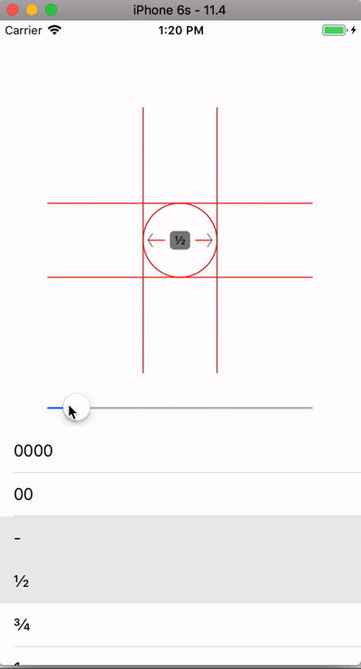

# Ring-Sizer-Swift

[](https://github.com/zelin/Ring-Sizer)
[](https://github.com/zelin/Ring-Sizer)
[](https://github.com/zelin/Ring-Sizer)
[](http://neberox.tk/donate/?amount=2&currency=USD)



## Installation

The easiest way to add the library to your project is by adding it as a dependency to your build.gradle

```ruby
dependencies {
   implementation 'com.neberox.library:ringsizer:0.0.1'
}
```

## Usage

### Using XML

 ```
  <com.neberox.library.ringsizer.RingSizer
        xmlns:app="http://schemas.android.com/apk/res-auto"
        android:layout_width="250dp"
        android:layout_height="250dp"
        android:layout_centerInParent="true"
        app:textPaddingWidth="5dp"
        />

```

### Create RingSizer programmatically
```java  

RelativeLayout mainLayout = findViewById(R.id.mainView);

RelativeLayout.LayoutParams params = new RelativeLayout.LayoutParams(400, 400);
params.addRule(CENTER_IN_PARENT);
RingSizer bar = new RingSizer(this);
mainLayout.addView(bar, params);

bar.setArrowStrokeWidth(20); //(Optional)
bar.setLinesStrokeWidth(20); //(Optional)
bar.setRingStrokeWidth(20); //(Optional)
bar.setRingStrokeWidth(20); //(Optional)
bar.setDiameter(9.91); //(Optional in mm)


bar.setArrowColor(Color.WHITE); //(Optional)
bar.setLinesColor(Color.parseColor("#f2b01e")); //(Optional)
bar.setTextColor(Color.LTGRAY); //(Optional)
bar.setTextBgColor(Color.LTGRAY); //(Optional)
bar.setFontSize(12); //(Optional)
bar.setTextPaddingWidth(10dp); //(Optional)
bar.setTextPaddingHeight(10dp); //(Optional)
```
### Set ratings programmatically

```java
bar.setSize(9.91, "0000"); //(Optional in mm, name of size)
```

## Attributes

| Name | Description | Default
| ------ | ------ | ------ |
| arrowStrokeWidth(optional) | Stroke width of the arrows | 1.0 |
| linesStrokeWidth(optional) | Stroke width of the lines of the grid | 1.0 |
| ringStrokeWidth(optional) | Stroke width of the circle upon which ring will be placed | 2.0 |
| diameter(optional) | Diameter of the ring. Should be in mm | 9.91 |
| arrowColor(optional) | Color of the arrows drawn. To remove color set UIColor.clear | UIColor.gray |
| linesColor(optional) | Color of the grid lines drawn. To remove color set UIColor.clear | UIColor.gray |
| textColor(optional) | Color of the size written in center of ring sizer | UIColor.black |
| textBgColor(optional) | Color of the background of textLabel | UIColor.gray |
| fontSize(optional) | Text font size | System font 12.0 |
| textPaddingWidth(optional) | left and right text Padding to add in textLabel | 10.0 |
| textPaddingHeight(optional) | top and bottom text Padding to add in textLabel | 5.0 |

## Author

Muhammad Umar, https://github.com/zelin

## License

Ring-Sizer is available under the MIT license. See the LICENSE file for more info.
